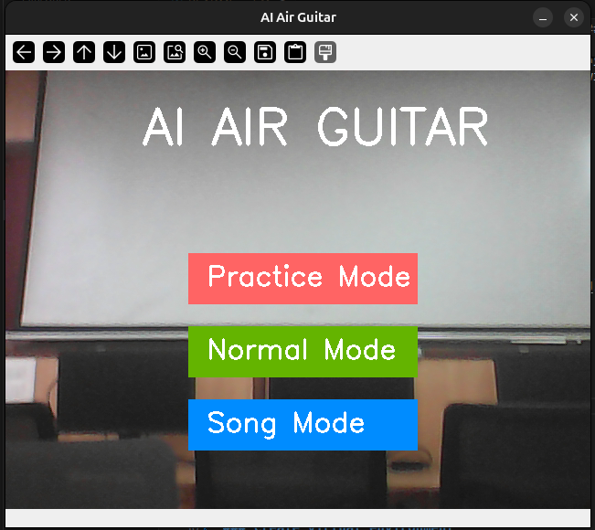
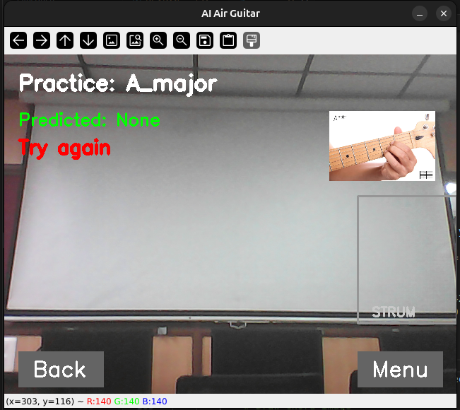
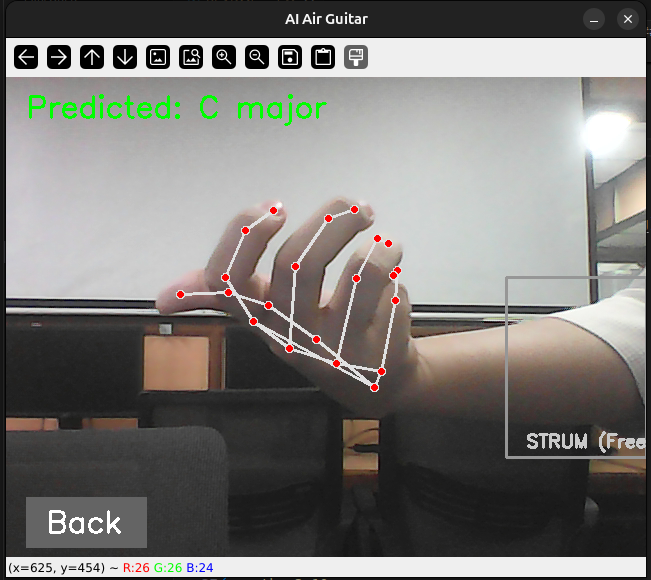
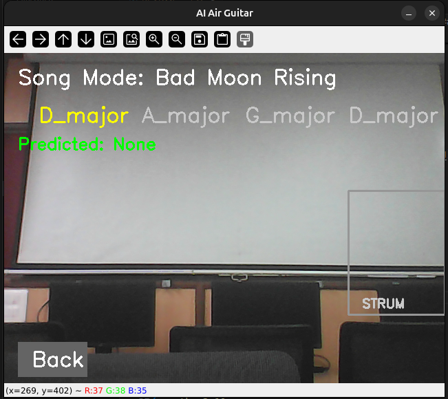

# Strumly – AI Air Guitar

Strumly is an AI-powered air-guitar application that uses **MediaPipe** and **OpenCV** to detect hand poses and predict guitar chords in real time using a trained **Random Forest model**.  
When you strum in a designated area, the app plays the corresponding guitar audio, allowing you to simulate playing chords without a physical guitar.

---

---

## Screenshots

### Main Menu

()

### Practice Mode

()

### Normal Mode

()

### Song Mode

()

---

---

## Setup & Installation

```bash
python3.10 -m venv venv           # Create Virtual Environment
source venv/bin/activate          # Linux/Mac
venv\Scripts\activate             # Windows
pip install -r requirements.txt
python main.py
```

---

---

## Team

| Member                                          |     |
| ----------------------------------------------- | --- |
| [Aditi Nair](https://github.com/addynair)       |
| [A. Sneha Sree](https://github.com/snehaalanka) |

---
